# OpenShift 3.11单机安装和使用

### 安装

建议系统内存>=6G，CPU>=4。在hosts中添加主机名。

    vi /etc/hosts
    192.168.1.42 os-node

开启SELINUX。

    vi /etc/selinux/config
    # This file controls the state of SELinux on the system.
    # SELINUX= can take one of these three values:
    #     enforcing - SELinux security policy is enforced.
    #     permissive - SELinux prints warnings instead of enforcing.
    #     disabled - No SELinux policy is loaded.
    SELINUX=enforcing
    # SELINUXTYPE= can take one of three values:
    #     targeted - Targeted processes are protected,
    #     minimum - Modification of targeted policy. Only selected processes are protected.
    #     mls - Multi Level Security protection.
    SELINUXTYPE=targeted

安装docker，此处安装1.13.1版本。

    yum install -y docker-1.13.1

添加私有仓库地址。

    vi /etc/docker/daemon.json
    {
    "insecure-registries": ["172.30.0.0/16"]
    }

    systemctl daemon-reload
    systemctl start docker
    systemctl enable docker

    docker version
    Client:
     Version:         1.13.1
     API version:     1.26
     Package version: docker-1.13.1-161.git64e9980.el7_8.x86_64
     Go version:      go1.10.3
     Git commit:      64e9980/1.13.1
     Built:           Tue Apr 28 14:43:01 2020
     OS/Arch:         linux/amd64

    Server:
     Version:         1.13.1
     API version:     1.26 (minimum version 1.12)
     Package version: docker-1.13.1-161.git64e9980.el7_8.x86_64
     Go version:      go1.10.3
     Git commit:      64e9980/1.13.1
     Built:           Tue Apr 28 14:43:01 2020
     OS/Arch:         linux/amd64
     Experimental:    false

可以提前下载openshift镜像。

    docker pull docker.io/openshift/origin-control-plane:v3.11
    docker pull docker.io/openshift/origin-hypershift:v3.11
    docker pull docker.io/openshift/origin-node:v3.11
    docker pull docker.io/openshift/origin-cli:v3.11
    docker pull docker.io/openshift/origin-hyperkube:v3.11
    docker pull docker.io/openshift/origin-pod:v3.11
    docker pull docker.io/openshift/origin-deployer:v3.11
    docker pull docker.io/openshift/origin-haproxy-router:v3.11
    docker pull docker.io/openshift/origin-docker-registry:v3.11
    docker pull docker.io/openshift/origin-web-console:v3.11
    docker pull docker.io/openshift/origin-service-serving-cert-signer:v3.11

下载[https://github.com/openshift/origin/releases/download/v3.11.0/openshift-origin-server-v3.11.0-0cbc58b-linux-64bit.tar.gz](https://github.com/openshift/origin/releases/download/v3.11.0/openshift-origin-server-v3.11.0-0cbc58b-linux-64bit.tar.gz)

    tar zxvf openshift-origin-server-v3.11.0-0cbc58b-linux-64bit.tar.gz
    mv openshift-origin-server-v3.11.0-0cbc58b-linux-64bit /usr/local/openshift-origin-server-v3.11.0

    vi /etc/profile
    export PATH=$PATH:/usr/local/openshift-origin-server-v3.11.0

    source /etc/profile

OpenShift版本号。

    oc version
    oc v3.11.0+0cbc58b
    kubernetes v1.11.0+d4cacc0
    features: Basic-Auth GSSAPI Kerberos SPNEGO

    Server https://192.168.1.42:8443
    kubernetes v1.11.0+d4cacc0

启动OpenShift集群。

    oc cluster up --public-hostname="192.168.1.42"
    Getting a Docker client ...
    Checking if image openshift/origin-control-plane:v3.11 is available ...
    Checking type of volume mount ...
    Determining server IP ...
    Using public hostname IP 192.168.1.42 as the host IP
    Checking if OpenShift is already running ...
    Checking for supported Docker version (=>1.22) ...
    Checking if insecured registry is configured properly in Docker ...
    Checking if required ports are available ...
    Checking if OpenShift client is configured properly ...
    Checking if image openshift/origin-control-plane:v3.11 is available ...
    Starting OpenShift using openshift/origin-control-plane:v3.11 ...
    I0529 21:27:48.962946    1675 flags.go:30] Running "create-kubelet-flags"
    I0529 21:27:50.617529    1675 run_kubelet.go:49] Running "start-kubelet"
    I0529 21:27:51.419303    1675 run_self_hosted.go:181] Waiting for the kube-apiserver to be ready ...
    I0529 21:28:29.466631    1675 interface.go:26] Installing "kube-proxy" ...
    I0529 21:28:29.466659    1675 interface.go:26] Installing "kube-dns" ...
    I0529 21:28:29.466670    1675 interface.go:26] Installing "openshift-service-cert-signer-operator" ...
    I0529 21:28:29.466680    1675 interface.go:26] Installing "openshift-apiserver" ...
    I0529 21:28:29.466724    1675 apply_template.go:81] Installing "openshift-apiserver"
    I0529 21:28:29.468138    1675 apply_template.go:81] Installing "kube-proxy"
    I0529 21:28:29.470193    1675 apply_template.go:81] Installing "kube-dns"
    I0529 21:28:29.470518    1675 apply_template.go:81] Installing "openshift-service-cert-signer-operator"
    I0529 21:29:05.999464    1675 interface.go:41] Finished installing "kube-proxy" "kube-dns" "openshift-service-cert-signer-operator" "openshift-apiserver"
    I0529 21:30:01.220960    1675 run_self_hosted.go:242] openshift-apiserver available
    I0529 21:30:01.221007    1675 interface.go:26] Installing "openshift-controller-manager" ...
    I0529 21:30:01.221094    1675 apply_template.go:81] Installing "openshift-controller-manager"
    I0529 21:30:05.706713    1675 interface.go:41] Finished installing "openshift-controller-manager"
    Adding default OAuthClient redirect URIs ...
    Adding persistent-volumes ...
    Adding router ...
    Adding sample-templates ...
    Adding web-console ...
    Adding centos-imagestreams ...
    Adding registry ...
    I0529 21:30:05.754522    1675 interface.go:26] Installing "persistent-volumes" ...
    I0529 21:30:05.754627    1675 interface.go:26] Installing "openshift-router" ...
    I0529 21:30:05.754642    1675 interface.go:26] Installing "sample-templates" ...
    I0529 21:30:05.754649    1675 interface.go:26] Installing "openshift-web-console-operator" ...
    I0529 21:30:05.754656    1675 interface.go:26] Installing "centos-imagestreams" ...
    I0529 21:30:05.755234    1675 interface.go:26] Installing "openshift-image-registry" ...
    I0529 21:30:05.755457    1675 interface.go:26] Installing "sample-templates/mongodb" ...
    I0529 21:30:05.755472    1675 interface.go:26] Installing "sample-templates/postgresql" ...
    I0529 21:30:05.755486    1675 interface.go:26] Installing "sample-templates/cakephp quickstart" ...
    I0529 21:30:05.755499    1675 interface.go:26] Installing "sample-templates/dancer quickstart" ...
    I0529 21:30:05.755511    1675 interface.go:26] Installing "sample-templates/nodejs quickstart" ...
    I0529 21:30:05.755523    1675 interface.go:26] Installing "sample-templates/jenkins pipeline ephemeral" ...
    I0529 21:30:05.755535    1675 interface.go:26] Installing "sample-templates/sample pipeline" ...
    I0529 21:30:05.755549    1675 interface.go:26] Installing "sample-templates/mariadb" ...
    I0529 21:30:05.755560    1675 interface.go:26] Installing "sample-templates/mysql" ...
    I0529 21:30:05.755570    1675 interface.go:26] Installing "sample-templates/django quickstart" ...
    I0529 21:30:05.755581    1675 interface.go:26] Installing "sample-templates/rails quickstart" ...
    I0529 21:30:05.755714    1675 apply_list.go:67] Installing "sample-templates/rails quickstart"
    I0529 21:30:05.756283    1675 apply_template.go:81] Installing "openshift-web-console-operator"
    I0529 21:30:05.756386    1675 apply_list.go:67] Installing "sample-templates/nodejs quickstart"
    I0529 21:30:05.756573    1675 apply_list.go:67] Installing "sample-templates/jenkins pipeline ephemeral"
    I0529 21:30:05.756604    1675 apply_list.go:67] Installing "centos-imagestreams"
    I0529 21:30:05.756832    1675 apply_list.go:67] Installing "sample-templates/sample pipeline"
    I0529 21:30:05.756932    1675 apply_list.go:67] Installing "sample-templates/mongodb"
    I0529 21:30:05.757013    1675 apply_list.go:67] Installing "sample-templates/mariadb"
    I0529 21:30:05.757101    1675 apply_list.go:67] Installing "sample-templates/postgresql"
    I0529 21:30:05.757195    1675 apply_list.go:67] Installing "sample-templates/mysql"
    I0529 21:30:05.757378    1675 apply_list.go:67] Installing "sample-templates/cakephp quickstart"
    I0529 21:30:05.757547    1675 apply_list.go:67] Installing "sample-templates/dancer quickstart"
    I0529 21:30:05.757381    1675 apply_list.go:67] Installing "sample-templates/django quickstart"
    I0529 21:30:12.597770    1675 interface.go:41] Finished installing "sample-templates/mongodb" "sample-templates/postgresql" "sample-templates/cakephp quickstart" "sample-templates/dancer quickstart" "sample-templates/nodejs quickstart" "sample-templates/jenkins pipeline ephemeral" "sample-templates/sample pipeline" "sample-templates/mariadb" "sample-templates/mysql" "sample-templates/django quickstart" "sample-templates/rails quickstart"
    I0529 21:30:13.962489    1675 interface.go:41] Finished installing "persistent-volumes" "openshift-router" "sample-templates" "openshift-web-console-operator" "centos-imagestreams" "openshift-image-registry"
    Server Information ...
    OpenShift server started.

    The server is accessible via web console at:
        https://192.168.1.42:8443

    You are logged in as:
        User:     developer
        Password: <any value>

    To login as administrator:
        oc login -u system:admin

> oc cluster up：安装并启动OpenShift集群命令，如果操作系统重新启动，需要重新执行。

> oc cluster down：停止OpenShift集群。

打开浏览器访问[https://192.168.1.42:8443](https://192.168.1.42:8443)访问OpenShift管理界面，使用system/admin登录。

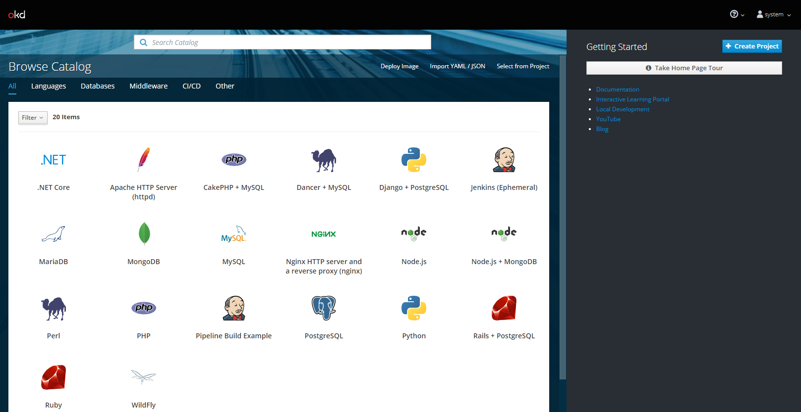

在命令行登录。

    oc login -u system:admin
    Logged into "https://192.168.1.42:8443" as "system:admin" using existing credentials.

    You have access to the following projects and can switch between them with 'oc project <projectname>':

        default
        kube-dns
        kube-proxy
        kube-public
        kube-system
      * myproject
        openshift
        openshift-apiserver
        openshift-controller-manager
        openshift-core-operators
        openshift-infra
        openshift-node
        openshift-service-cert-signer
        openshift-web-console

    Using project "myproject".

oc应该需要明确的命名空间，或者project。

    oc get all
    No resources found.

    oc get all -ndefault
    NAME                                READY     STATUS      RESTARTS   AGE
    pod/docker-registry-1-mcqv5         1/1       Running     2          14h
    pod/persistent-volume-setup-7c2s4   0/1       Completed   0          14h
    pod/router-1-2wrj2                  1/1       Running     2          14h

    NAME                                      DESIRED   CURRENT   READY     AGE
    replicationcontroller/docker-registry-1   1         1         1         14h
    replicationcontroller/router-1            1         1         1         14h

    NAME                      TYPE        CLUSTER-IP       EXTERNAL-IP   PORT(S)                   AGE
    service/docker-registry   ClusterIP   172.30.1.1       <none>        5000/TCP                  14h
    service/kubernetes        ClusterIP   172.30.0.1       <none>        443/TCP                   14h
    service/router            ClusterIP   172.30.183.172   <none>        80/TCP,443/TCP,1936/TCP   14h

    NAME                                DESIRED   SUCCESSFUL   AGE
    job.batch/persistent-volume-setup   1         1            14h

    NAME                                                 REVISION   DESIRED   CURRENT   TRIGGERED BY
    deploymentconfig.apps.openshift.io/docker-registry   1          1         1         config
    deploymentconfig.apps.openshift.io/router            1          1         1         config

    oc get all --all-namespaces
    NAMESPACE                       NAME                                                          READY     STATUS      RESTARTS   AGE
    default                         pod/docker-registry-1-mcqv5                                   1/1       Running     2          14h
    default                         pod/persistent-volume-setup-7c2s4                             0/1       Completed   0          14h
    default                         pod/router-1-2wrj2                                            1/1       Running     2          14h
    kube-dns                        pod/kube-dns-qqk4r                                            1/1       Running     2          14h
    kube-proxy                      pod/kube-proxy-9dzmd                                          1/1       Running     2          14h
    kube-system                     pod/kube-controller-manager-localhost                         1/1       Running     2          14h
    kube-system                     pod/kube-scheduler-localhost                                  1/1       Running     3          14h
    kube-system                     pod/master-api-localhost                                      1/1       Running     4          14h
    kube-system                     pod/master-etcd-localhost                                     1/1       Running     2          14h
    openshift-apiserver             pod/openshift-apiserver-x2kjj                                 1/1       Running     2          14h
    openshift-controller-manager    pod/openshift-controller-manager-5mmgt                        1/1       Running     2          14h
    openshift-core-operators        pod/openshift-service-cert-signer-operator-6d477f986b-9mgpl   1/1       Running     2          14h
    openshift-core-operators        pod/openshift-web-console-operator-664b974ff5-bshc8           1/1       Running     2          14h
    openshift-service-cert-signer   pod/apiservice-cabundle-injector-8ffbbb6dc-887fd              1/1       Running     2          14h
    openshift-service-cert-signer   pod/service-serving-cert-signer-668c45d5f-fw9mz               1/1       Running     2          14h
    openshift-web-console           pod/webconsole-66bc79b96-z2pn2                                1/1       Running     3          14h

    NAMESPACE   NAME                                      DESIRED   CURRENT   READY     AGE
    default     replicationcontroller/docker-registry-1   1         1         1         14h
    default     replicationcontroller/router-1            1         1         1         14h

    NAMESPACE                       NAME                                  TYPE        CLUSTER-IP       EXTERNAL-IP   PORT(S)                   AGE
    default                         service/docker-registry               ClusterIP   172.30.1.1       <none>        5000/TCP                  14h
    default                         service/kubernetes                    ClusterIP   172.30.0.1       <none>        443/TCP                   14h
    default                         service/router                        ClusterIP   172.30.183.172   <none>        80/TCP,443/TCP,1936/TCP   14h
    kube-dns                        service/kube-dns                      ClusterIP   172.30.0.2       <none>        53/UDP,53/TCP             14h
    openshift-apiserver             service/api                           ClusterIP   172.30.150.121   <none>        443/TCP                   14h
    openshift-service-cert-signer   service/service-serving-cert-signer   ClusterIP   172.30.111.128   <none>        443/TCP                   14h
    openshift-web-console           service/webconsole                    ClusterIP   172.30.164.246   <none>        443/TCP                   14h

    NAMESPACE                      NAME                                          DESIRED   CURRENT   READY     UP-TO-DATE   AVAILABLE   NODE SELECTOR   AGE
    kube-dns                       daemonset.apps/kube-dns                       1         1         1         1            1           <none>          14h
    kube-proxy                     daemonset.apps/kube-proxy                     1         1         1         1            1           <none>          14h
    openshift-apiserver            daemonset.apps/openshift-apiserver            1         1         1         1            1           <none>          14h
    openshift-controller-manager   daemonset.apps/openshift-controller-manager   1         1         1         1            1           <none>          14h

    NAMESPACE                       NAME                                                     DESIRED   CURRENT   UP-TO-DATE   AVAILABLE   AGE
    openshift-core-operators        deployment.apps/openshift-service-cert-signer-operator   1         1         1            1           14h
    openshift-core-operators        deployment.apps/openshift-web-console-operator           1         1         1            1           14h
    openshift-service-cert-signer   deployment.apps/apiservice-cabundle-injector             1         1         1            1           14h
    openshift-service-cert-signer   deployment.apps/service-serving-cert-signer              1         1         1            1           14h
    openshift-web-console           deployment.apps/webconsole                               1         1         1            1           14h

    NAMESPACE                       NAME                                                                DESIRED   CURRENT   READY     AGE
    openshift-core-operators        replicaset.apps/openshift-service-cert-signer-operator-6d477f986b   1         1         1         14h
    openshift-core-operators        replicaset.apps/openshift-web-console-operator-664b974ff5           1         1         1         14h
    openshift-service-cert-signer   replicaset.apps/apiservice-cabundle-injector-8ffbbb6dc              1         1         1         14h
    openshift-service-cert-signer   replicaset.apps/service-serving-cert-signer-668c45d5f               1         1         1         14h
    openshift-web-console           replicaset.apps/webconsole-66bc79b96                                1         1         1         14h
    openshift-web-console           replicaset.apps/webconsole-dccc4b4b9                                0         0         0         14h

    NAMESPACE   NAME                                DESIRED   SUCCESSFUL   AGE
    default     job.batch/persistent-volume-setup   1         1            14h

    NAMESPACE   NAME                                                 REVISION   DESIRED   CURRENT   TRIGGERED BY
    default     deploymentconfig.apps.openshift.io/docker-registry   1          1         1         config
    default     deploymentconfig.apps.openshift.io/router            1          1         1         config

    NAMESPACE   NAME                                        DOCKER REPO                            TAGS                         UPDATED
    openshift   imagestream.image.openshift.io/dotnet       172.30.1.1:5000/openshift/dotnet       2.0,latest                   15 hours ago
    openshift   imagestream.image.openshift.io/httpd        172.30.1.1:5000/openshift/httpd        2.4,latest                   15 hours ago
    openshift   imagestream.image.openshift.io/jenkins      172.30.1.1:5000/openshift/jenkins      1,2,latest                   15 hours ago
    openshift   imagestream.image.openshift.io/mariadb      172.30.1.1:5000/openshift/mariadb      10.2,latest,10.1             15 hours ago
    openshift   imagestream.image.openshift.io/mongodb      172.30.1.1:5000/openshift/mongodb      2.4,2.6,3.2 + 3 more...      15 hours ago
    openshift   imagestream.image.openshift.io/mysql        172.30.1.1:5000/openshift/mysql        latest,5.5,5.6 + 1 more...   15 hours ago
    openshift   imagestream.image.openshift.io/nginx        172.30.1.1:5000/openshift/nginx        1.10,1.12,1.8 + 1 more...    15 hours ago
    openshift   imagestream.image.openshift.io/nodejs       172.30.1.1:5000/openshift/nodejs       6,8,8-RHOAR + 4 more...      15 hours ago
    openshift   imagestream.image.openshift.io/perl         172.30.1.1:5000/openshift/perl         5.16,5.20,5.24 + 2 more...   15 hours ago
    openshift   imagestream.image.openshift.io/php          172.30.1.1:5000/openshift/php          5.5,5.6,7.0 + 2 more...      15 hours ago
    openshift   imagestream.image.openshift.io/postgresql   172.30.1.1:5000/openshift/postgresql   10,9.2,9.4 + 3 more...       15 hours ago
    openshift   imagestream.image.openshift.io/python       172.30.1.1:5000/openshift/python       3.4,3.5,3.6 + 3 more...      15 hours ago
    openshift   imagestream.image.openshift.io/redis        172.30.1.1:5000/openshift/redis        3.2,latest                   15 hours ago
    openshift   imagestream.image.openshift.io/ruby         172.30.1.1:5000/openshift/ruby         2.0,2.2,2.3 + 3 more...      15 hours ago
    openshift   imagestream.image.openshift.io/wildfly      172.30.1.1:5000/openshift/wildfly      11.0,12.0,13.0 + 5 more...   15 hours ago

### 私有仓库

注意到内置了私有仓库service/docker-registry，也可以从上面看出私有仓库已经预置了一些镜像。

登录openshift，system/admin。

    oc login
    Authentication required for https://192.168.1.42:8443 (openshift)
    Username: system
    Password:
    Login successful.

    You don't have any projects. You can try to create a new project, by running

        oc new-project <projectname>

获取token。

    oc whoami -t
    Bs00S5VglTUUk1YJlDqgGZkbBqUnDsVxHPKsccVwyfs

登录私有仓库，密码使用token。

    docker login 172.30.1.1:5000
    Username: system
    Password:
    Login Succeeded

从私有仓库下拉镜像，私有仓库的镜像应该是现从docker.io上拉取的。

    docker pull 172.30.1.1:5000/openshift/mysql
    Using default tag: latest
    Trying to pull repository 172.30.1.1:5000/openshift/mysql ...
    latest: Pulling from 172.30.1.1:5000/openshift/mysql
    d8d02d457314: Pull complete
    a11069b6e245: Pull complete
    596303fb1aa3: Pull complete
    a29499e779a7: Pull complete
    17d1a52c2e00: Pull complete
    ed24591227fe: Pull complete
    de0ad46e3ed9: Pull complete
    c62e4a984a9c: Pull complete
    01d54c6bda68: Pull complete
    Digest: sha256:e08ee4d43b7356607685b69bde6335e27cf20c020f345b6c6c59400183882764
    Status: Downloaded newer image for 172.30.1.1:5000/openshift/mysql:latest

    docker images
    REPOSITORY                              TAG                 IMAGE ID            CREATED             SIZE
    172.30.1.1:5000/openshift/mysql         latest              f83a2938370c        7 months ago        452 MB

### 部署应用

先创建一个工程，工程project和Kubernetes的命名空间是一对一的，应用都需要部署在工程中。

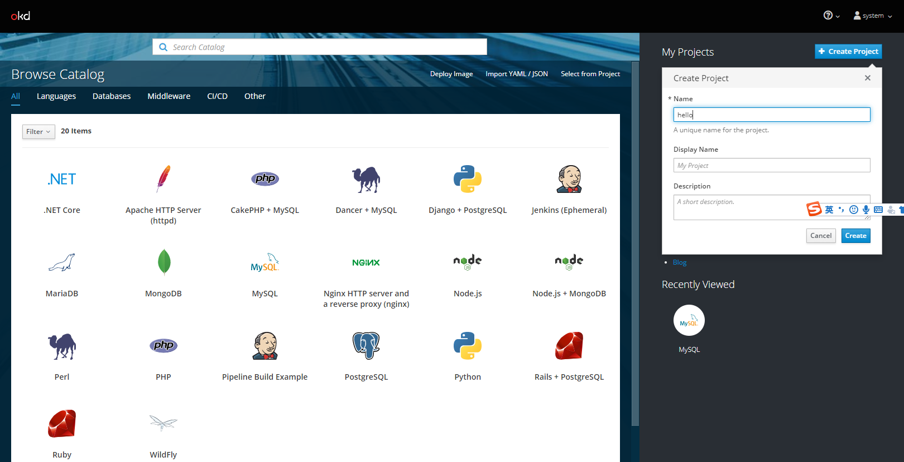

使用镜像直接部署应用。

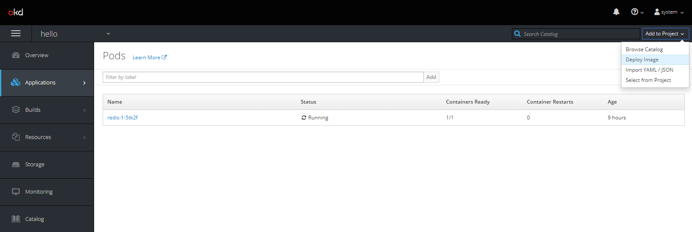

我们选择Apache HTTP Server (httpd)镜像。

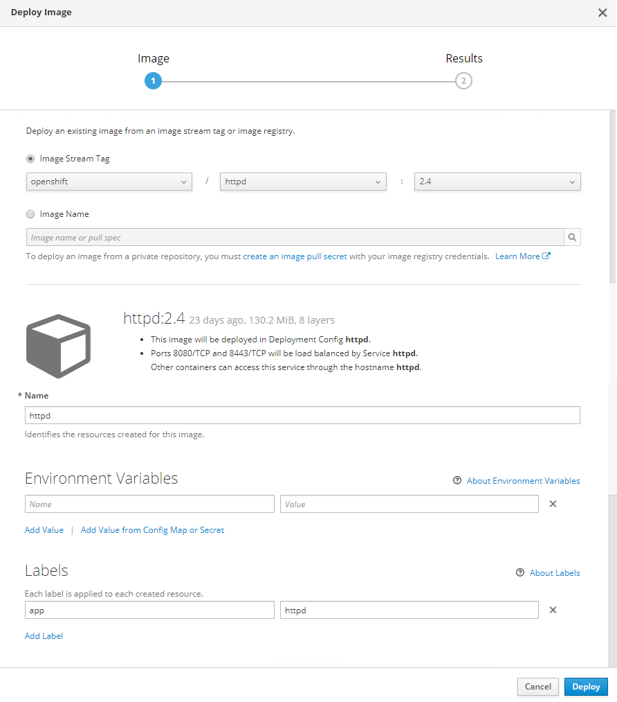

点击Deploy按钮部署该应用。

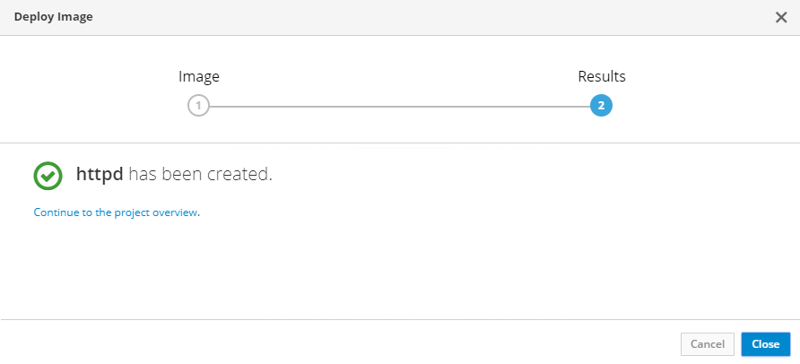

可查看已经部署的应用。

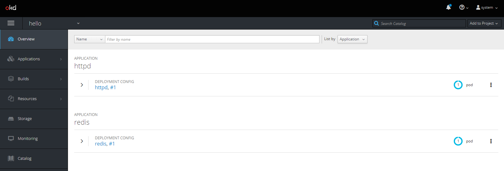

应用的deployments资源。

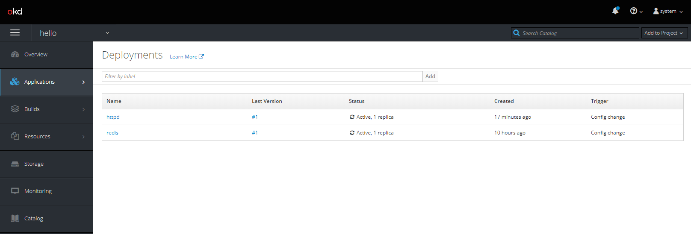

应用的pods资源。

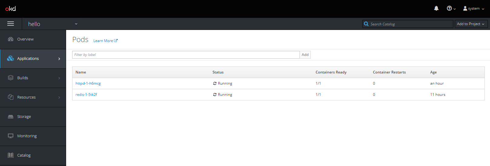

应用的services资源。

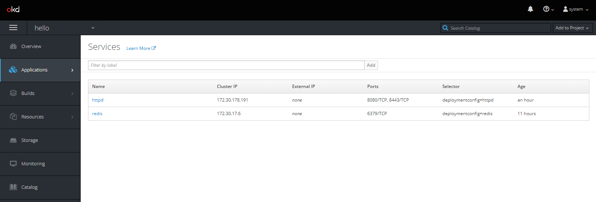

OpensShift监控应用。

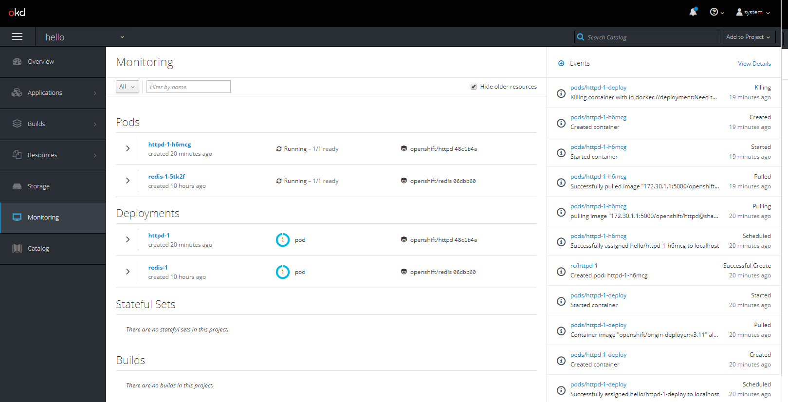

可以在命令行查看，注意工程project和命名空间namespace是一对一的。

    oc get all -nhello
    NAME                READY     STATUS    RESTARTS   AGE
    pod/httpd-1-h6mcg   1/1       Running   0          20m
    pod/redis-1-5tk2f   1/1       Running   0          9h

    NAME                            DESIRED   CURRENT   READY     AGE
    replicationcontroller/httpd-1   1         1         1         20m
    replicationcontroller/redis-1   1         1         1         9h

    NAME            TYPE        CLUSTER-IP       EXTERNAL-IP   PORT(S)             AGE
    service/httpd   ClusterIP   172.30.178.191   <none>        8080/TCP,8443/TCP   20m
    service/redis   ClusterIP   172.30.17.6      <none>        6379/TCP            9h

    NAME                                       REVISION   DESIRED   CURRENT   TRIGGERED BY
    deploymentconfig.apps.openshift.io/httpd   1          1         1         config,image(httpd:2.4)
    deploymentconfig.apps.openshift.io/redis   1          1         1         config,image(redis:3.2)

通过curl访问一下httpd。

    curl http://172.30.178.191:8080
    <!DOCTYPE html PUBLIC "-//W3C//DTD XHTML 1.1//EN" "http://www.w3.org/TR/xhtml11/DTD/xhtml11.dtd">

    <html xmlns="http://www.w3.org/1999/xhtml" xml:lang="en">
            <head>
                    <title>Test Page for the Apache HTTP Server on Red Hat Enterprise Linux</title>
                    <meta http-equiv="Content-Type" content="text/html; charset=UTF-8" />
                    
            </head>

            <body>
                    <h1>Red Hat Enterprise Linux <strong>Test Page</strong></h1>

                    

                            

                                    
This page is used to test the proper operation of the Apache HTTP server after it has been installed. If you can read this page, it means that the Apache HTTP server installed at this site is working properly.

                            

                            

                            

                                    

                                            <h2>If you are a member of the general public:</h2>

                                            
The fact that you are seeing this page indicates that the website you just visited is either experiencing problems, or is undergoing routine maintenance.

                                            
If you would like to let the administrators of this website know that you've seen this page instead of the page you expected, you should send them e-mail. In general, mail sent to the name "webmaster" and directed to the website's domain should reach the appropriate person.

                                            
For example, if you experienced problems while visiting www.example.com, you should send e-mail to "webmaster@example.com".

                                            
For information on Red Hat Enterprise Linux, please visit the <a href="http://www.redhat.com/">Red Hat, Inc. website</a>. The documentation for Red Hat Enterprise Linux is <a href="http://www.redhat.com/docs/manuals/enterprise/">available on the Red Hat, Inc. website</a>.

                                            

                                    

                                    

                                            <h2>If you are the website administrator:</h2>

                                            
You may now add content to the directory <tt>/var/www/html/</tt>. Note that until you do so, people visiting your website will see this page, and not your content. To prevent this page from ever being used, follow the instructions in the file <tt>/etc/httpd/conf.d/welcome.conf</tt>.

                                            
You are free to use the image below on web sites powered by the Apache HTTP Server:

                                            

                                    

                            

                    

            </body>
    </html>

为了在集群外能否访问集群内应用，需要添加Route，OpenShift使用HAProxy实现Router的。

    netstat -lntp | grep haproxy
    tcp        0      0 127.0.0.1:10443         0.0.0.0:*               LISTEN      125023/haproxy
    tcp        0      0 127.0.0.1:10444         0.0.0.0:*               LISTEN      125023/haproxy
    tcp        0      0 0.0.0.0:80              0.0.0.0:*               LISTEN      125023/haproxy
    tcp        0      0 0.0.0.0:443             0.0.0.0:*               LISTEN      125023/haproxy

我们创建一个Route。

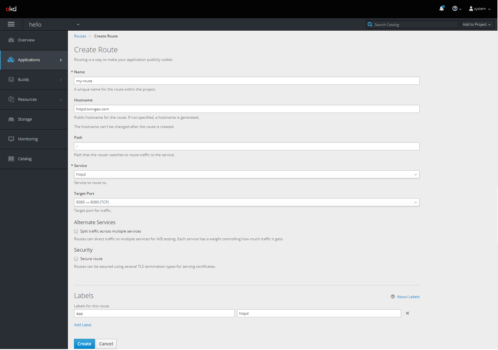

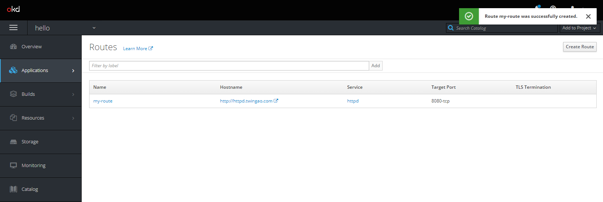

通过命令行可以看到增加一条路由。

    oc get all -nhello
    NAME                READY     STATUS    RESTARTS   AGE
    pod/httpd-1-h6mcg   1/1       Running   0          35m
    pod/redis-1-5tk2f   1/1       Running   0          10h

    NAME                            DESIRED   CURRENT   READY     AGE
    replicationcontroller/httpd-1   1         1         1         35m
    replicationcontroller/redis-1   1         1         1         10h

    NAME            TYPE        CLUSTER-IP       EXTERNAL-IP   PORT(S)             AGE
    service/httpd   ClusterIP   172.30.178.191   <none>        8080/TCP,8443/TCP   35m
    service/redis   ClusterIP   172.30.17.6      <none>        6379/TCP            10h

    NAME                                       REVISION   DESIRED   CURRENT   TRIGGERED BY
    deploymentconfig.apps.openshift.io/httpd   1          1         1         config,image(httpd:2.4)
    deploymentconfig.apps.openshift.io/redis   1          1         1         config,image(redis:3.2)

    NAME                                HOST/PORT           PATH      SERVICES   PORT       TERMINATION   WILDCARD
    route.route.openshift.io/my-route   httpd.twingao.com             httpd      8080-tcp                 None

尝试访问一下。

    curl -H "Host: http.twingao.com" http://192.168.1.42
    <html>
      <head>
        <meta name="viewport" content="width=device-width, initial-scale=1">

      
      </head>
      <body>
        

          <h1>Application is not available</h1>
          
The application is currently not serving requests at this endpoint. It may not have been started or is still starting.

          

            

              Possible reasons you are seeing this page:
            

            <ul>
              <li>
                <strong>The host doesn't exist.</strong>
                Make sure the hostname was typed correctly and that a route matching this hostname exists.
              </li>
              <li>
                <strong>The host exists, but doesn't have a matching path.</strong>
                Check if the URL path was typed correctly and that the route was created using the desired path.
              </li>
              <li>
                <strong>Route and path matches, but all pods are down.</strong>
                Make sure that the resources exposed by this route (pods, services, deployment configs, etc) have at least one pod running.
              </li>
            </ul>
          

        

      </body>
    </html>

也可以通过浏览器访问，先添加`C:\Windows\System32\drivers\etc\hosts`。

    192.168.1.42 httpd.twingao.com

在浏览器输入地址[http://httpd.twingao.com/](http://httpd.twingao.com/)。

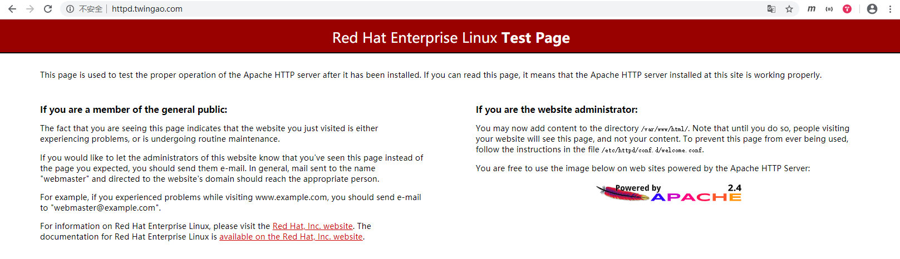

结束。